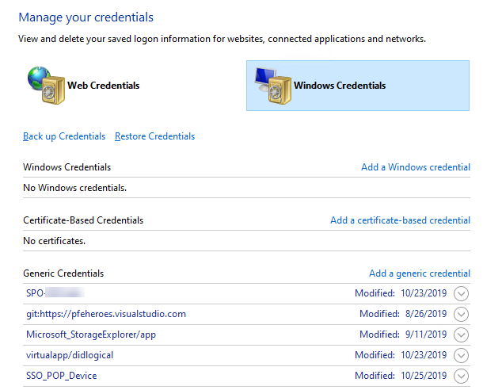
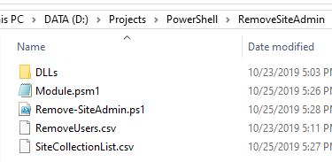

# Remote Site Collection Admin PS

This is a PowerShell script to remove Site Collection admins from a CSV. 

# Instruction

* Install [PnP SharePoint Online PowerShell](https://docs.microsoft.com/en-us/powershell/sharepoint/sharepoint-pnp/sharepoint-pnp-cmdlets?view=sharepoint-ps).
* Add a "generic credential" call "SPO" to include your username and password for your SPO sites access from "Control Panel"->"User Accounts"->"Manage Windows Credentials". 

* Unzip the file and the following folder structure will be shown.

* Update RemoveUsers.csv to include the users which you want to remove.
* Update SiteCollectionList.csv to include the site collections URL which you want to process. 
* Open up a PowerShell and run Remove-SiteAdmin.ps1. you also see that a log file with name log_[guid].txt will be created

